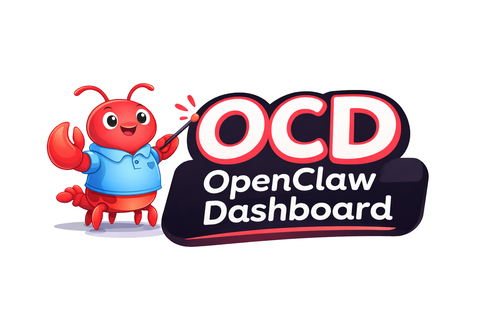

<p align="center">
  
</p>
<h3 align="center">OCD — OpenClaw Dashboard</h3>
<p align="center">Real-time Kanban board and encrypted message feed for tracking autonomous AI agent work.</p>

---

## What This Repo Does

OCD is a self-hosted Next.js dashboard for monitoring AI coding agents. Claude Code, OpenCode, Codex, or any agent that can hit a REST endpoint can push status updates here. You get a live board showing what's running, what's stuck, and what shipped.

The Kanban board has 6 status columns (pending, in_progress, review, blocked, completed, icebox), drag-and-drop reordering, and 3 priority levels with weighted scoring (5/3/1). Tasks support parent/child relationships up to 3 levels deep, inline comments, and sprint assignment.

Velocity tracking and burndown charts are built in. Seven analytics chart types cover throughput, cycle time, status distribution, priority breakdown, agent workload, completion trends, and blocked task aging. All of it reads from a local SQLite database with WAL mode, no external database required.

The message feed uses NaCl secretbox (XSalsa20-Poly1305) for encrypted agent notifications. Agents can tag messages to specific tasks or sessions, leaving durable breadcrumbs you can audit later.

The dashboard polls every 3 seconds, runs in dark mode, and binds to 127.0.0.1 by default. It was built for headless Mac Minis accessed over Tailscale, but it works anywhere you can run a Node process. Agents POST events to the REST API; the board updates automatically.

---

## Quick Start

```bash
git clone https://github.com/Keeeeeeeks/opencode-dashboard.git
cd opencode-dashboard
bun install
cp .env.example .env.local
# Edit .env.local -- set DASHBOARD_API_KEY=$(openssl rand -hex 32)
bun run build && bun run start
# Optional: bun run seed (sample data)
# Dashboard at http://127.0.0.1:3000
```

---

## Authentication

The dashboard has two independent auth layers:

| Layer | Purpose | Controlled by |
|-------|---------|---------------|
| **API key** | Machine-to-machine (agents POST data) | `DASHBOARD_API_KEY` |
| **Browser login** | Human users viewing the dashboard | GitHub OAuth or `DISABLE_AUTH` |

### Option A: Disable browser auth (private networks)

If the dashboard is only reachable over Tailscale, a home LAN, or localhost, you can skip the login screen entirely:

```env
DISABLE_AUTH=true
```

The dashboard will be open to anyone who can reach it on the network. API key auth for agents is unaffected — agents still need `Authorization: Bearer <key>` to POST data.

### Option B: GitHub OAuth (recommended for shared access)

If multiple people need access, or the dashboard is reachable from less-trusted networks, enable GitHub login:

1. Go to [GitHub Developer Settings](https://github.com/settings/developers) → **OAuth Apps** → **New OAuth App**
2. Fill in:
   - **Application name**: anything (e.g. `OpenCode Dashboard`)
   - **Homepage URL**: your dashboard URL (e.g. `http://127.0.0.1:3000` or your Tailscale URL)
   - **Authorization callback URL**: `<your-url>/api/auth/callback`
     - Example: `https://my-machine.tail12345.ts.net/opencode/api/auth/callback`
     - Local dev: `http://127.0.0.1:3000/api/auth/callback`
3. Copy the **Client ID** and generate a **Client Secret**, then add them to `.env.local`:

```env
GITHUB_CLIENT_ID=your_client_id
GITHUB_CLIENT_SECRET=your_client_secret
```

4. Start the dashboard and visit the login page. **The first person to sign in becomes the owner.** Everyone else gets a 403 until the owner invites them from Settings → Team.

---

## What You Need to Make It Sing

The dashboard provides the API and UI. Getting agents to automatically update the board requires a bit of wiring on your end.

### Unified Message/Task Queue

OCD doesn't come with a message broker. To get agents (Claude Code, OpenCode, Codex, etc.) pushing updates automatically, you need:

- A shared task queue that your IDE terminals and agent runtimes can push to
- The included `opencode-hook/dashboard-hook.ts` is a starting point. It POSTs agent events to the dashboard API.
- Wire it into whatever orchestration layer you use: oh-my-opencode hooks, Claude Code custom commands, Codex task runners, etc.

The mental model: agents do work, a hook intercepts events, the hook POSTs to the dashboard API, the board updates.

### Prompt Format for Handoff

When handing a task to an agent, include enough context for the dashboard to track it:

```json
{
  "content": "Implement feature X",
  "status": "pending",
  "priority": "high",
  "agent": "sisyphus",
  "project": "my-project",
  "session_id": "ses_abc123"
}
```

Agents POST to `/api/todos` with Bearer auth. See `docs/api.md` for the full schema.

### Additional Cron Jobs

The dashboard doesn't auto-refresh itself or notify you. Set up cron jobs for the things that matter.

**Board refresh** -- periodically check for stale tasks:

```bash
openclaw cron add --name "Check board" --every 4h \
  --message "Check /api/todos for stale in_progress tasks or high-priority pending items."
```

**Human notifications on blockers/completions** -- alert yourself when tasks get stuck or finish:

```bash
openclaw cron add --name "Blocker alert" --cron "*/30 * * * *" \
  --message "Check /api/todos?status=blocked -- notify me if anything is blocked."
```

**Ongoing write-ups** -- have an agent periodically summarize progress:

```bash
openclaw cron add --name "Progress digest" --cron "0 18 * * *" \
  --message "Write a 3-sentence summary of today's completed tasks from /api/analytics."
```

---

## What This Repo Does NOT Do

- **Does not assume unsupervised all-day agent cooking.** This is a monitoring dashboard, not an autopilot. It shows you what agents are doing so you can intervene. You still need to check in.

- **Does not configure cron jobs or heartbeats for you.** The dashboard is passive. It receives events and displays them. Setting up the hooks, crons, and notification pipelines is on you. The section above tells you what to set up.

- **Does not hand off stuck tasks to CLI agents.** If a task is blocked, the dashboard shows it. It does NOT automatically reassign work, spawn new agents, or retry failed tasks. That's orchestration. Build it on top if you want it.

---

## Architecture

```
┌──────────────────────────── Mac mini (headless) ────────────────────────────┐
│                                                                              │
│  OpenClaw Gateway (18789, loopback)   OCD Next.js app (3000, loopback)      │
│  └─ /api/agent + cron API             └─ SQLite + NaCl @ ~/.opencode-dash   │
│        ^                                      ^                              │
│        |  REST                                |  REST/JSON                  │
│        |                                      |                              │
│  oh-my-opencode / IDE hooks ─────────────────>|  /api/todos                 │
│  Claude Code hooks          ─────────────────>|  /api/messages              │
│  Codex task runners         ─────────────────>|  /api/analytics             │
│                                                                              │
│              Tailscale Serve (/ -> 18789, /opencode -> 3000)                │
└──────────────────────────────────────────────────────────────────────────────┘
                                   ^
                                   | encrypted WireGuard tunnel
                                   |
                           Human devices (phone, laptop, other agents)
```

Both services bind to 127.0.0.1. Nothing touches 0.0.0.0. Tailscale Serve handles HTTPS without exposing LAN ports.

---

## Tech Stack

| Layer | Tech |
|-------|------|
| Frontend | Next.js 16, React 19, Tailwind CSS, @dnd-kit, Zustand |
| Database | SQLite (better-sqlite3, WAL mode) |
| Encryption | tweetnacl (NaCl secretbox) |
| Testing | Playwright (e2e) |
| Access | Tailscale (WireGuard mesh VPN) |

---

## Documentation

- `ARCHITECTURE.md` -- full system architecture and v2 schema
- `docs/` -- task hierarchy spec, worklog API, analytics reference
- `docs/api.md` -- REST API reference (todos, messages, analytics, sprints)
- `docs/deployment.md` -- full deployment guide (Mac Mini setup, launchd, Tailscale Serve config)

---

## Contributing

Fork, branch, PR. Run `bun run lint` and `bun run test:e2e` before submitting.

Bug reports and feature requests go in Issues. Pull requests should describe how the change affects humans, agents, and automation (three short bullets). The loopback-only default is intentional -- don't change it without a solid security model.

---

## License

MIT

